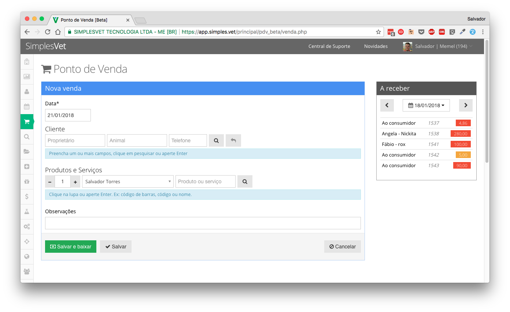
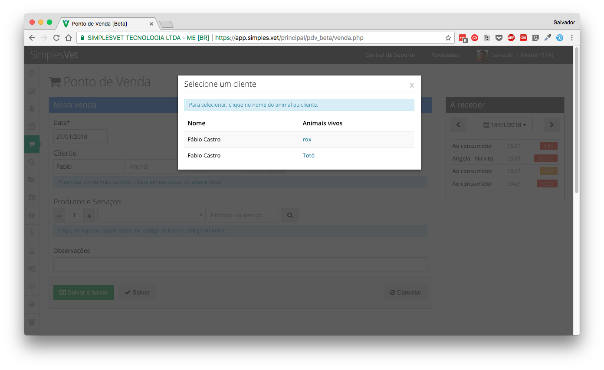
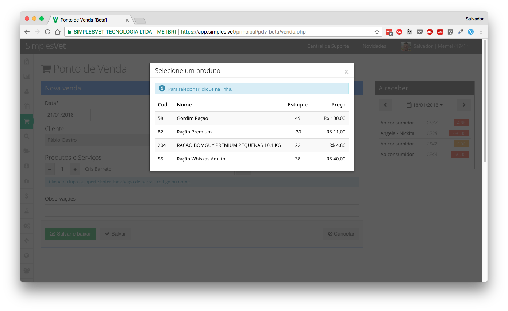
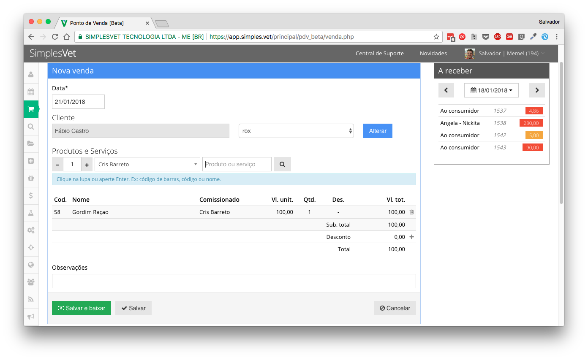
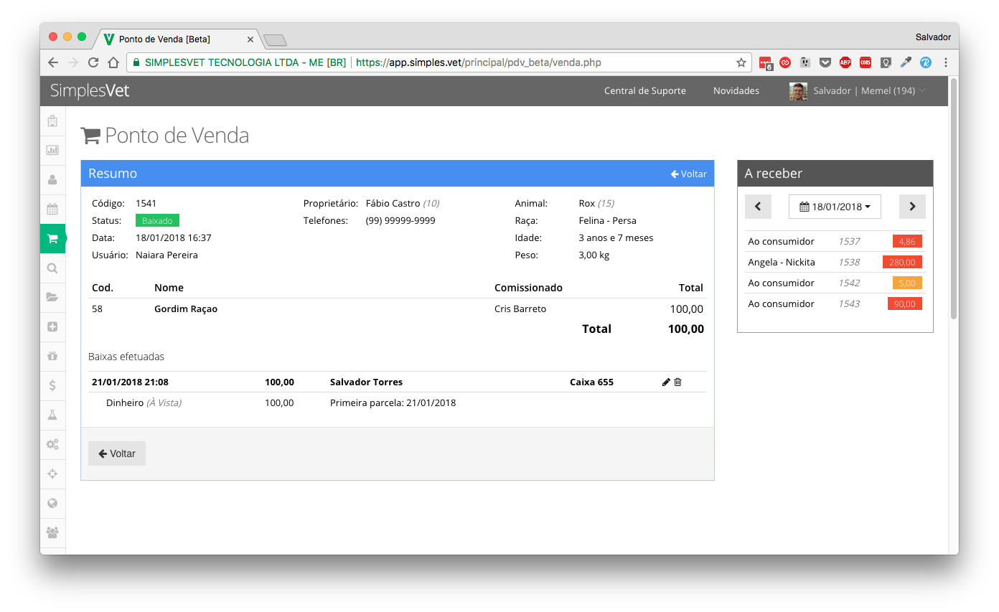

# Missão para Front-end na SimplesVet

A SimplesVet está re-recriando a sua tela de **Ponto de Venda** e para isso iremos utilizar uma nova tecnologia de front-end! \o/

## Funcionalidades

1. Pesquisar, listar e selecionar **clientes**
2. Alterar cliente selecionado
3. Pesquisar, listar e selecionar **produtos**
4. Alterar a quantidade do **produto** selecionado na venda
5. Inserir e alterar uma **venda**
6. **Listar vendas** no widget da direita, filtrando **por dia** 
7. Detalhamento da venda ao clicar numa venda do widget ou quando salvar.

## Tecnologia

Nesse projeto, será necessário criar a aplicação em [Angular](https://angular.io/) (versão 5 ou mais recente, não vale o AngularJS).

## Endpoints API

Para facilitar o desenvolvimento do front, criei um Mock de uma API no serviço mockapi.io. Da uma olhada na [documentação](http://www.mockapi.io/docs), lá explica como foram gerados todos os endpoints e quais estão disponíveis.

1. http://5a652f32acd74f00128c6028.mockapi.io/api/v1/clientes
2. http://5a652f32acd74f00128c6028.mockapi.io/api/v1/vendas
3. http://5a652f32acd74f00128c6028.mockapi.io/api/v1/produtos

Se quiser criar os seus mocks ou a própria API (em qualquer linguagem), pode ficar à vontade. Lembre-se: o que será avaliado é apenas o **FRONT-END**.

## Entrega do projeto

Responda para o email que você recebeu com o link para o seu repositório e a aplicação rodando.

## Referências

Veja alguns prints da página atual, que podem ser usados como referência. 

### Tela inicial

### Pesquisar/selecionar **clientes**

### Pesquisar/selecionar **produtos**

### Inclusão ou edição de uma **venda**

### Visualização de uma **venda**

PS: Não precisa se preocupar em Menus, Topos, Logins, etc. Basta as funções do **Ponto de Venda**.

PS[2]: Fique livre para propor outro esquisa de navegação ou experiência. Não precisa ser exatamente igual ao que está nso prints.

PS[3]: Pode usar qualquer tipo de lib/template para interface. Ex: material, bootstrap, etc.

PS[4]: Não tem nenhuma restrição ao uso de plugins.
